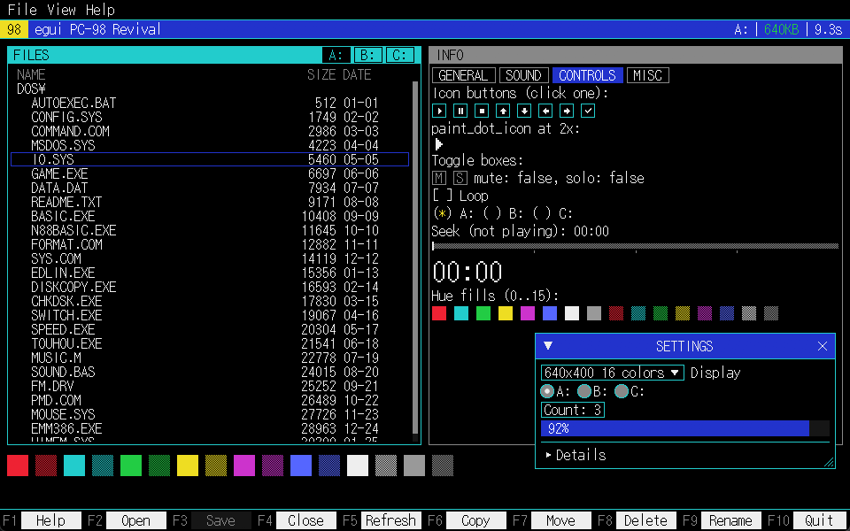

# egui-pc98-revival

A theme, bundled bitmap font, and small set of widgets that make an
[egui](https://github.com/emilk/egui) app look like a NEC PC-98 text-mode UI:
a digital 8-color palette, sharp corners with no shadows or anti-aliasing,
and geometry snapped to whole device pixels. Included are widgets for a
titled panel, a header bar, a function-key bar, a keyboard-driven list view,
dialogs, and more.



## Quick start

```toml
[dependencies]
egui-pc98-revival = "0.1"
```

Call `apply` once, in the `eframe::App` creation closure, and `ensure` once
per frame:

```rust,ignore
struct App;

impl App {
    fn new(cc: &eframe::CreationContext<'_>) -> Self {
        egui_pc98_revival::apply(&cc.egui_ctx);
        Self
    }
}

impl eframe::App for App {
    fn ui(&mut self, ui: &mut egui::Ui, _frame: &mut eframe::Frame) {
        egui_pc98_revival::ensure(ui.ctx());

        egui::CentralPanel::default().show(ui, |ui| {
            egui_pc98_revival::panel(ui, "FILES", |ui| {
                ui.label("25 FILES");
            });

            let items = [
                egui_pc98_revival::FKey::new("F1", "Help").key_shortcut(egui::Key::F1),
                egui_pc98_revival::FKey::new("F10", "Quit").key_shortcut(egui::Key::F10),
            ];
            if let Some(clicked) = egui_pc98_revival::fkey_bar(ui, &items) {
                // handle a click on items[clicked], or its bound key having been pressed
            }
        });
    }
}

eframe::run_native(
    "My App",
    eframe::NativeOptions::default(),
    Box::new(|cc| Ok(Box::new(App::new(cc)))),
);
```

Run the bundled demo (eframe + wgpu):

```sh
cargo run --example demo
```

Set `PC98_DEMO_ZOOM` (e.g. `PC98_DEMO_ZOOM=1.5`) to preview the demo at
other display scale factors.

## Widgets

### Layout & chrome

`TitledPanel`/`panel` is a bordered panel with a title strip; `panel(ui,
title, add_contents)` is shorthand for `TitledPanel::new(title).show(..)`.
`show_with_title` adds a right-aligned slot in the title strip, filled by
its own closure before the content closure:

```rust,ignore
egui_pc98_revival::TitledPanel::new("FILES")
    .focused(true)
    .show_with_title(
        ui,
        |ui| { ui.label("25 FILES"); }, // right-aligned slot in the title strip
        |ui| { ui.label("some content"); },
    );
```

`.double_frame(true)` draws a double border (outer line, 1-dot gap, inner
line) around the whole panel instead of the default single 1-dot frame;
content should stay inset at least 4 dots to clear it. An unfocused panel
(`.focused(false)`) draws dimmed.

`HeaderBar` builds a full-width title/status bar: an optional accent badge,
left text, and right-aligned items separated by 1-dot rules that drop by
priority when the bar gets narrow:

```rust,ignore
egui_pc98_revival::HeaderBar::new()
    .badge("98")
    .left("egui PC-98 Revival")
    .item("A:", None, Some(2))          // dropped first when narrow
    .item("640KB", Some(palette.ok), Some(1))
    .item(&clock, None, None)           // never dropped
    .show(ui);
```

`header_bar(ui, left, right)` is a shorthand for a plain left text plus one
right-aligned item, with no badge and no separators.

`fkey_bar`/`FKey` draws the function-key button row shown in Quick start; a
disabled item (`.enabled(false)`) draws dimmed and ignores both clicks and
its bound key.

`tab_strip` draws a row of tabs and updates `selected` when one is clicked;
`TabStyle::TitleStrip` fits a `TitledPanel` title-strip slot (current tab
cut out in `ground`), `TabStyle::Bar` is for a standalone strip on `ground`:

```rust,ignore
egui_pc98_revival::tab_strip(
    ui,
    &mut self.tab,
    &["GENERAL", "SOUND"],
    egui_pc98_revival::TabStyle::Bar,
);
```

`Dialog` shows a `TitledPanel` centered over a dithered scrim; the
background does not take input. Esc requests close, and so does a
`ui.close()` call from inside `add_contents`; the caller owns the flag that
keeps the dialog open:

```rust,ignore
if self.show_help {
    let result = egui_pc98_revival::Dialog::new(egui::Id::new("help"), "HELP")
        .show(ui.ctx(), |ui| {
            ui.label("Esc  Close this dialog");
        });
    if result.close_requested {
        self.show_help = false;
    }
}
```

`message_box` is a `Dialog` with a text body and an `fkey_bar` button row;
the caller owns the open flag and stops calling it once a result comes back:

```rust,ignore
if self.confirm_delete {
    let result = egui_pc98_revival::message_box(
        ui.ctx(),
        egui::Id::new("confirm"),
        "DELETE",
        "Delete FOO.TXT?\nThis cannot be undone.",
        &[
            egui_pc98_revival::FKey::new("Y", "Yes").key_shortcut(egui::Key::Y),
            egui_pc98_revival::FKey::new("N", "No").key_shortcut(egui::Key::N),
        ],
    );
    match result {
        Some(egui_pc98_revival::MessageBoxResult::Button(0)) => { /* deleted */ }
        Some(egui_pc98_revival::MessageBoxResult::Button(_))
        | Some(egui_pc98_revival::MessageBoxResult::Dismissed) => { /* cancelled */ }
        None => {}
    }
    if result.is_some() {
        self.confirm_delete = false;
    }
}
```

`Button(i)` is a click or shortcut on button `i`; `Dismissed` is Esc with no
button bound to `Key::Escape` (a bound button wins over the dismiss path).

| Name | What it does |
| --- | --- |
| `key_help(ui, rows)` | Two-column key/description list, keys right-aligned in `accent`, for a HELP dialog or similar. |

### Controls

`ListView` is a keyboard-driven scrolling list: a column header, a
full-width selection bar that follows the cursor (Up/Down/PageUp/PageDown/
Home/End), and priority-based column dropping when narrow. `state.cursor`
(a `ListState`) is the persistent selection; the row closure passed to
`show` draws each visible row through `ListRow::cell` (or `cell_ui` for
custom widgets); `response.activated` is set on Enter or a double-click:

```rust,ignore
let columns = [
    egui_pc98_revival::Column::new("NAME", egui_pc98_revival::ColumnWidth::Fill { min_cells: 12 }),
    egui_pc98_revival::Column::new("SIZE", egui_pc98_revival::ColumnWidth::Cells(7))
        .align(egui::Align::Max)
        .drop_priority(1),
];
let response = egui_pc98_revival::ListView::new("files", names.len())
    .columns(&columns)
    .show(ui, &mut self.list_state, |row, i| {
        row.cell(0, names[i], None);
        row.cell(1, &sizes[i], None);
    });
if let Some(i) = response.activated {
    // Enter or double-click on row `i`.
}
```

`SegmentBar` draws a row or column of equal blocks with 1-dot gaps (level
meter, volume blocks, gauge). `show` is display-only; `show_interactive`
also reads click, drag and mouse wheel input and writes whole-segment steps
back into `value`:

```rust,ignore
egui_pc98_revival::SegmentBar::new(12, level)
    .warn(10, palette.warn) // top 2 segments turn warn-colored when lit
    .show(ui);

egui_pc98_revival::SegmentBar::new(10, 0.0)
    .fill(palette.frame)
    .warn(8, palette.accent)
    .show_interactive(ui, &mut self.volume);
```

| Name | What it does |
| --- | --- |
| `seek_bar(ui, &mut value, ticks)` | Dithered track with a filled position, a 2-dot handle, and tick marks; click or drag anywhere in it to set `value` (`f32` in `0..=1`). |
| `toggle_box(ui, &mut on, letter)` | `[M]`-style letter box that flips a `bool` on click or, when focused, on Space/Enter. |
| `toggle_box_colored(ui, &mut on, letter, color)` | `toggle_box` with a different "on" fill. |
| `text_checkbox(ui, &mut checked, label)` | `[*] label` / `[ ] label`, drawn with the bitmap font instead of egui's own checkbox glyph. Tab focuses, Space toggles. |
| `text_radio(ui, &mut current, value, label)` | `(*) label` / `( ) label`, same focus/toggle behavior as `text_checkbox`. |
| `icon_button(ui, icon)` | Square, framed button showing a `DotIcon` (see Painting). |

### Display

`marquee` draws a fixed `max_cells`-wide label: text that fits is shown as
is; text that overflows pauses for a second, then scrolls left one cell at a
time with a 3-space gap before looping, never splitting a wide character
across the visible window. It requests repaints only while the text
overflows, so a label that fits requests no repaints:

```rust,ignore
egui_pc98_revival::marquee(ui, "PC-9801 シリーズ", 12, palette.frame);
```

| Name | What it does |
| --- | --- |
| `text_spinner(ui)` | One-cell `\| / - \` spinner, drawn from dot rects rather than font glyphs (see Glyph caveats); requests repaints only while visible. |

### Painting

Low-level painters for building custom widgets on the same dot grid and
palette as the bundled ones; see [Styling and scaling](#styling-and-scaling)
for a full example with `dot`, `palette` and `snap_rect`.

| Name | What it does |
| --- | --- |
| `paint_frame(painter, rect, color)` | Single 1-dot frame. |
| `paint_double_frame(painter, rect, color)` | Outer line, 1-dot gap, inner line, for an FD/FILMTN-style border; content should be inset at least 4 dots to clear it. Rects smaller than 6 dots on either side get only the outer line, since a smaller inner rect would collapse or invert. |
| `paint_dither(painter, rect, fg, bg)` | Fills a rect with a 1-dot checkerboard dither of `fg`, painted over `bg` if given (otherwise the gaps stay transparent). |
| `paint_scrim(painter, rect)` | Dithered scrim painted behind a `Dialog`. |
| `paint_hue_fill(painter, rect, index, bg)` | Fills a rect with one of 16 distinguishable fills: `index % 16` 0-7 is a palette hue drawn solid, 8-15 is the same hue dithered over `bg` (default `ground`). |

`DotIcon` variants (`Play`, `Pause`, `Stop`, `ArrowUp`, `ArrowDown`,
`ArrowLeft`, `ArrowRight`, `Check`) are glyph-free: the bundled font draws
Ambiguous symbols (○●■□ etc.) full-width, so a real icon set is drawn from
axis-aligned dot rects instead. `paint_dot_icon` paints one directly, scaled
by a whole number of dots to fit the given rect:

```rust,ignore
let rect = egui::Rect::from_min_size(pos, egui::vec2(28.0, 28.0)); // 2x a 7x7 icon at 2 dots/cell
egui_pc98_revival::paint_dot_icon(
    ui.painter(),
    rect,
    egui_pc98_revival::DotIcon::Pause,
    egui_pc98_revival::palette(ui.ctx()).text,
);
```

### Text & layout helpers

`text::cells` counts the on-screen width of a string in half-width cells
(see [Glyph caveats](#glyph-caveats) for the counting rule); `truncate_cells`
truncates to whole cells, `truncate_tail` does the same and appends an ASCII
`"..."` (never `…`) when it cuts text short:

```rust,ignore
use egui_pc98_revival::text;

assert_eq!(text::cells("日本語"), 6);
assert_eq!(text::truncate_tail("日本電気株式会社製パーソナルコンピュータ", 12), "日本電気...");
let cell_w = text::cell_width(ui);
```

| Name | What it does |
| --- | --- |
| `text::char_cells(c)` | Cell width (1 or 2) of a single character; the rule `cells` and `truncate_*` are built on. |
| `text::marquee_slice(text, max_cells, step)` | Computes the same scrolled window as `marquee`, for custom painting. |
| `text::cell_width(ui)` | Width, in points, of one half-width cell in the current style. |

`fit_by_priority` decides which items to keep so their widths (plus `gap`
between kept neighbours) fit in `available`; items with `None` are never
dropped, and among droppable items the highest priority value drops first:

```rust,ignore
let widths = [40.0, 30.0, 20.0];
let drop_priority = [None, Some(1), Some(2)]; // first item is never dropped
let keep = egui_pc98_revival::fit_by_priority(&widths, &drop_priority, 4.0, 75.0);
```

## Styling and scaling

`apply(ctx)` installs the bundled font (feature `bundled-font`) and the
default `Palette`, then applies the style. Call it once, when the egui
context is created; `apply` forces the dark theme, since the PC-98 look has
no light variant:

```rust,ignore
egui_pc98_revival::apply(&cc.egui_ctx);
```

`apply_with(ctx, &palette)` applies the style for a specific `Palette`
without touching fonts, for a custom palette. Call `ensure(ctx)` once per
frame, after `apply`; it re-applies the stored style only when
`pixels_per_point` has changed, for example after the window moves to a
display with a different OS scale factor, so it is cheap to call
unconditionally:

```rust,ignore
egui_pc98_revival::ensure(ctx);
```

`Palette` (from `palette(ctx)`, or built directly) names each role widgets
paint with (`ground`, `frame`, `text`, `dim`, `accent`, `bar_bg`, ...), drawn
from the 8-color hue set, plus semantic aliases — `ok`, `warn`, `danger`,
`selected_fg`, `hover_fg` — so status colors stay consistent with the
active theme.

Build custom widgets on the same dot grid as the bundled ones. One "dot" is
a whole number of device pixels, computed from the current
`pixels_per_point`: `dot(ctx)` gives the size of one dot in logical points,
`dots(ctx, n)` gives `n` dots, and `snap_rect(ctx, rect)` rounds every edge
of a rect to the nearest device pixel so it lands exactly on the pixel grid
instead of being anti-aliased:

```rust,ignore
let d = egui_pc98_revival::dot(ui.ctx());
let inset = egui_pc98_revival::dots(ui.ctx(), 4.0);
let palette = egui_pc98_revival::palette(ui.ctx());

let rect = egui_pc98_revival::snap_rect(ui.ctx(), ui.available_rect_before_wrap());
ui.painter().rect_filled(rect.shrink(inset), 0, palette.ground);
egui_pc98_revival::paint_frame(ui.painter(), rect, palette.frame);
```

Frame strokes and the font size set by the PC-98 style are likewise
multiples of a dot.

`font_id_scaled(ctx, factor)` returns the Body font at an integer multiple
of its size, for big readouts; only integer factors keep the dots crisp:

```rust,ignore
ui.label(egui::RichText::new("03:14").font(egui_pc98_revival::font_id_scaled(ui.ctx(), 2)));
```

## Fonts and glyphs

The `bundled-font` feature (on by default) bundles a baseline-aligned copy
of the "KH Dot Kodenmachou 16" font (see [License](#license)) and installs
it as the default monospace and proportional font via `apply`.

Without `bundled-font`, install a font yourself with
`fonts::font_definitions_with` and a substitute dot font:

```rust,ignore
let data = egui_pc98_revival::fonts::pixel_font_data(my_font_bytes);
ctx.set_fonts(egui_pc98_revival::fonts::font_definitions_with("My Dot Font", data));
```

`pixel_font_data` disables hinting and subpixel binning, both of which
would blur a font whose glyph outlines are already aligned to a pixel grid.

The crate embeds a modified copy of the font,
`assets/fonts/KH-Dot-Kodenmachou-16-Ki-aligned.ttf`. The original places its
dot grid a quarter dot below the baseline, so egui splits every horizontal
stroke across two pixel rows; the copy moves all outlines and vertical
metrics up by that quarter dot and is otherwise unchanged. Regenerate it
with:

```sh
uv run scripts/align_font.py assets/fonts/KH-Dot-Kodenmachou-16-Ki.ttf assets/fonts/KH-Dot-Kodenmachou-16-Ki-aligned.ttf
```

### Glyph caveats

The bundled font follows JIS X 0208 and departs from plain Unicode
rendering at a few code points:

- Backslash renders as the yen sign (¥).
- The fullwidth hyphen-minus (U+FF0D, `－`) is missing; use the minus sign
  (U+2212, `−`) instead.
- Box-drawing characters and `▶` are absent and fall back to egui's default
  font, so widget-produced text stays ASCII.
- Unicode Ambiguous-width characters (for example Greek, Cyrillic, and
  `−`) are drawn full-width, matching the font's East Asian layout.

`text::cells` and the other functions in the [`text`](#text--layout-helpers)
module count East Asian Wide, Fullwidth and Ambiguous characters as 2 cells
and everything else as 1, with overrides for the points above where the
bundled font differs from the Unicode default, so the count matches how the
bundled font renders text.

## Stock egui widget notes

`apply` restyles egui's own widgets (buttons, menus, combo boxes, windows,
scroll areas, and so on), but `egui::ProgressBar` rounds its ends regardless
of the style. Pass `.corner_radius(0)` to keep it square.

## License

The code in this repository is licensed under the MIT license; see
[`LICENSE`](LICENSE).

The bundled font, "KH Dot Kodenmachou 16"
(`assets/fonts/KH-Dot-Kodenmachou-16-Ki.ttf`), was designed by Keitarou
Hiraki and converted to TrueType by Jikasei Font Koubou
(<http://jikasei.me/font/kh-dotfont/>). It is licensed under the SIL Open
Font License 1.1; the full text is in
[`assets/fonts/SIL_Open_Font_License_1.1.txt`](assets/fonts/SIL_Open_Font_License_1.1.txt).

The crate embeds a modified copy,
`assets/fonts/KH-Dot-Kodenmachou-16-Ki-aligned.ttf`, which is also under the
SIL Open Font License 1.1. It differs from the original only in a quarter-dot
vertical shift; see [Fonts and glyphs](#fonts-and-glyphs).
